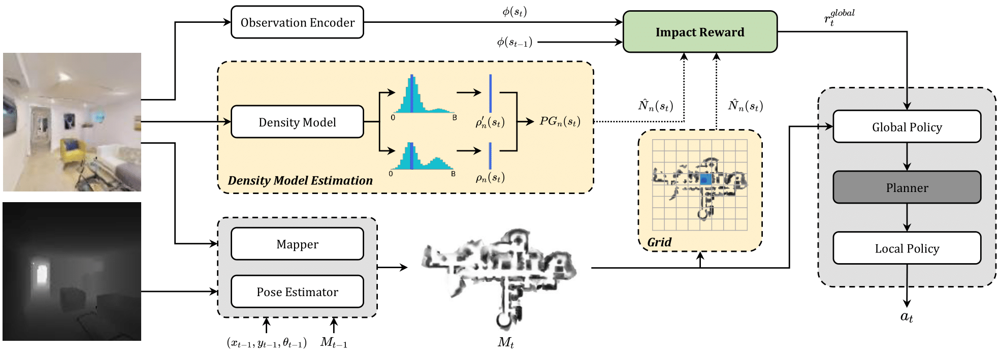

# Focus on Impact

This is the PyTorch implementation for our paper:

[**Focus on Impact: Indoor Exploration with Intrinsic Motivation**](https://arxiv.org/abs/2109.08521)<br>
__***Roberto Bigazzi***__, Federico Landi, Silvia Cascianelli, Lorenzo Baraldi, Marcella Cornia, Rita Cucchiara<br>


## Table of Contents
   1. [Abstract](#abstract)
   2. [Installation](#installation)
   3. [Pretrained Weights](#pretrained-weights)
   4. [Real-World Deployment](#real-world-deployment)
   5. [Acknowledgements](#acknowledgements)

## Abstract

In this work, we propose to train the model with a purely intrinsic reward signal to guide exploration, which is based on the impact of the robot's actions on its internal representation of the environment. So far, impact-based rewards have been employed for simple tasks and in procedurally generated synthetic environments with countable states. Since the number of states observable by the agent in realistic indoor environments is non-countable, we include a neural-based density model and replace the traditional count-based regularization with an estimated pseudo-count of previously visited states.

The proposed exploration approach outperforms DRL-based competitors relying on intrinsic rewards and surpasses the agents trained with a dense extrinsic reward computed with the environment layouts. We also show that a robot equipped with the proposed approach seamlessly adapts to point-goal navigation and real-world deployment.

<p align="center">

</p>

## Installation

1. Create an environment with *conda*:
    ```
    conda create -n focus_on_imp python=3.6 cmake=3.14.0
    source activate focus_on_imp
    ```
    
2. Install *[Habitat-Lab](https://github.com/facebookresearch/habitat-lab)* and *[Habitat-Sim](https://github.com/facebookresearch/habitat-sim)* following the instructions in the respective repositories.

3. Clone this repository:
    ```
    git clone --recursive https://github.com/aimagelab/focus-on-impact
    cd focus-on-impact
    ```
    
4. Download the scene datasets *[Gibson](https://github.com/StanfordVL/GibsonEnv#database)* and *[Matterport3D](https://niessner.github.io/Matterport/)* and store them in `data/scene_datasets/`.
 
5. Install *[A* algorithm](https://github.com/srama2512/astar_pycpp)* used by the Planner:
    ```
    cd occant_utils
    git clone https://github.com/srama2512/astar_pycpp
    cd astar_pycpp
    make
    cd ../..
    ```
    
## Pretrained Weights
| Name     | Link |
| ---      | ---  |
| Impact (Grid) | *[Here](https://drive.google.com/file/d/1XpQxB6nZrDVH4C7c2XD9FWNZ7p7f6PMb/view?usp=sharing)* |
| Impact (DME)  | *[Here](https://drive.google.com/file/d/1Kk4js6Dujadws-0FU0ng9pOIohzcySla/view?usp=sharing)* |

## Real-World Deployment
For instructions on the real-world deployment of the models please follow *[LocoNav](https://github.com/aimagelab/LoCoNav)* instructions.

## Acknowledgements
This repository uses parts of *[Habitat-Lab](https://github.com/facebookresearch/habitat-lab)* and *[Habitat-Sim](https://github.com/facebookresearch/habitat-sim)*. We also used *[Occupancy Anticipation](https://github.com/facebookresearch/OccupancyAnticipation)*[1] for some of the competitors and for part of the Mapper.

[1] Santhosh K. Ramakrishnan, Ziad Al-Halah, and Kristen Grauman. "Occupancy anticipation for efficient exploration and navigation." In ECCV 2020.
